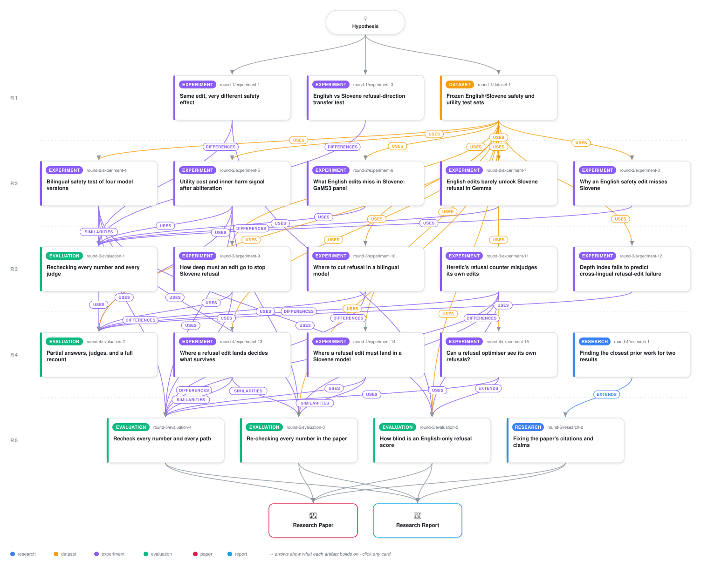

# What English-tuned abliteration misses in Slovene

<div align="center">

<a href="https://cdn.jsdelivr.net/gh/ai-inventor-papers/ai-invention-beaa2a-what-english-tuned-abliteration-misses@main/workflow.svg">
<picture>
  <source media="(prefers-color-scheme: dark)" srcset="workflow-dark.svg">
  
</picture>
</a>

<sub>🖱️ <b><a href="https://cdn.jsdelivr.net/gh/ai-inventor-papers/ai-invention-beaa2a-what-english-tuned-abliteration-misses@main/workflow.svg">Open the interactive diagram</a></b> — every card links to its artifact folder.</sub>

</div>

> **TL;DR** — The English keyword objective used to verify abliterated checkpoints is structurally blind to its own edit in Slovene. Neither Heretic search reached the primary selection rule; every optimiser candidate that a reference judge considers well-abliterated is invisible to the keyword counter (threshold-blind fraction 1.0). The keyword counter fires on 87% of English responses but 0% of Slovene responses, while the judge finds 13% English and 82% Slovene refusal (Delta_lang = -1.56, 95% CI [-1.68, -1.44]). The edit transfers fully to GaMS3 (Slovene refusal 87% to 0%) but fails on Gemma (94% to 74%), meaning keyword-verified checkpoints cannot serve as language-neutral references for refusal evaluation.

<details>
<summary>Full hypothesis</summary>

TITLE CLAIM. What decides how much refusal survives a Heretic-family English-derived WEIGHT edit -
in English, in Slovene, in German, and in a second model family - is WHERE in depth the edit's
removal energy sits. Not how much energy it carries, not how many layers it touches, not how well
its direction aligns with the target language's refusal direction, and not how much dose is applied:
at matched total removal energy AND matched layer count, a mid-depth band removes refusal while a
late-depth band leaves it essentially untouched, and DOUBLING the dose of the badly placed edit does
not buy what the well-placed edit buys at half the energy. The band is SHARED - across the two
languages, across the two sibling checkpoints, and (on three languages) across an outside family.
The language-conditioned and the checkpoint-specific readings of this claim are both now FALSIFIED
BY OUR OWN PLACEBOS and must be struck from the paper. The cross-language "gap" this run started
from is a property of an under-dosed, badly-placed SELECTED edit - selected by an objective whose
floor sits above its own selection rule's threshold in BOTH searches - and not a property of either
model.

=== WHAT ITERATION 4 SETTLED (executed numbers, each with its artifact and file) ===

(P-1) PLACEMENT BEATS DOSE AND BEATS DIRECTION GEOMETRY, OUT OF SAMPLE, IN THREE MODELS. This is the
run's surviving positive and the next round must hold it.
  - Gemma [art_NpZ_nW6qgSKD, results/analysis.json + report_tables.md, 209/209 re-derived, shuffled-O
    and label-swap placebos fail as required]: across 8 groups matched on BOTH closed-form removal
    energy AND layer count, the high-overlap member leaves less refusal in 8/8 groups in BOTH
    languages; pooled EN -0.69 [-0.75, -0.62], SL -0.38 [-0.46, -0.31]. The extreme contrast is
    layers 16-31 at EN 0.07 / SL 0.27 versus layers 33-48 at EN 0.92 / SL 0.92 AT THE SAME ENERGY.
    THE DOSE RIVAL FAILS: a 2x dose of the late-layer edit still leaves EN 0.88 / SL 0.92.
    Energy-matched write-space random and harmless-PC controls stay within +-0.03 of the no-op.
  - GaMS3 [art_bxpIbe7-nSvR, results/analysis_summary.json + report_tables.md, 352/352 re-derived,
    cell-permutation null +0.003 and energy-profile-shuffle null -0.017 against the real -0.903]:
    over 20 confirmation cells of 12 edited layers each, energy matched within 0.6%, on 70 held-out
    Llama-Guard-category StrongREJECT pairs per language, Spearman(placement overlap, surviving SL
    strict refusal) = -0.903 [-0.928, -0.857], p < 0.001; WITHIN energy level -0.967 (E2) and
    -0.948 (E3); incremental R2 over log removal energy 0.580, leave-one-cell-out 0.594; it beats
    log energy (-0.384), depth span (-0.039) and mean depth (-0.328) with paired-bootstrap CIs
    excluding zero. All six controls null (|dSL| <= 0.03 against a no-op of 0.957).
  - OUTSIDE THE FAMILY [art_NpZ_nW6qgSKD outside/]: Qwen3-8B, 9/9 matched-energy contrasts favour
    the better-placed member, 8/9 CIs excluding zero; Spearman EN -0.76, SL -0.93, DE -0.84.
  - THE BAND IS THE SAME ONE IN BOTH SIBLINGS AT MATCHED ENERGY. GaMS3 Table 4: at E2 the SL strict
    ranking is B2 (13-24) 0.50 < B3 (25-36) 0.59 < B4 0.93 < B1 0.97, and at E3 B2 0.30 < B3 0.53 <
    B4 0.94 < B1 0.97. Gemma's frozen argmax band prediction (13-24) PASSES.

(P-2) THE SPECIFICITY CLAIMS ARE DEAD, AND THE PAPER MUST SAY SO IN THE SAME BREATH AS P-1.
  - LANGUAGE-SPECIFIC: FALSIFIED. exp13's language-label placebo does NOT collapse - the ENGLISH
    profile predicts the SLOVENE residual at -0.94. The instrument works by locating a SHARED
    mid-depth band.
  - CHECKPOINT-SPECIFIC: FALSIFIED. exp14 boundary 3: the GaMS3 profile predicts Gemma's 50 weight
    cells at -0.442, no worse than it predicts its own iteration-3 panel (-0.278 screen / -0.111
    confirm split). The GaMS3 DEV argmax named 25-36 and LOST at matched energy at both levels
    (NAMED_AND_LOST, Table 4). The only surviving evidence for a different GaMS3 band is exp10's
    UNMATCHED c=1 grid, where eval2's R1 recompute corrects band 25-36 from 0.02 to 0.12
    [0.02, 0.22]; the disagreement between the matched and unmatched readouts is UNRESOLVED and must
    be reported as unresolved, not as a finding.
  - CONSEQUENCE: "the critical band differs between siblings" must be struck as a finding, as a
    novelty qualifier, and as the candidate explanation of the iteration-1 dissociation. exp14's
    A1-A4 ladder already shows the two production kernels are indistinguishable once dose is matched
    (placement at fixed high E -0.029 [-0.129, +0.071], p 0.774; at fixed low E 0.000
    [-0.086, +0.086], p 1.000; post-freeze Table 6b d 0.071 and 0.029, CIs including zero).

(P-3) THE EXPENSIVE INSTRUMENT LOSES TO A CHEAP ONE - AND THAT IS THE PRACTITIONER RESULT, not a
failure to hide. The 48-site causal write profile O was FALSIFIED as an incremental instrument in
Gemma: over a nuisance stack containing the g-weighted EN/SL direction cosine it adds dR2 = 0.0261
EN (powered, MDE 0.0471) and 0.0555 SL (MDE 0.1090, inconclusive), both under the 0.10 bar and the
EN value under the 0.05 falsifier [analysis.json confirm.per_language]. The reason is collinearity,
NOT that energy already explains the outcome: R2 of log energy ALONE is 0.0012 EN / 0.0077 SL, O
alone reaches 0.873 / 0.754, cosine alone 0.831 / 0.630, and O over energy + count alone adds
0.895 / 0.770. In GaMS3 the four-number band profile (LOO dR2 0.845) and the purely geometric
cosine overlap (0.834) BEAT the 48-site profile (0.594), and the same cell's English outcome
predicts its Slovene one at rho 0.945. Reported positively: one forward pass per band - four
measurements, not forty-eight - is enough to order matched-energy edits.

(P-4) THE SELECTION OBJECTIVE COULD NOT FIRE ITS OWN RULE IN EITHER SEARCH [art_F46S3uP80BUa,
81/81 re-derived, both GaMS3 searches replayed bit-exact to the iteration-1 journal]. The frozen
primary prediction - that Gemma's objective is BLINDER by the pairwise gradient-blind fraction -
was FALSIFIED (classifier-referenced +0.006 [0.000, 0.019]; judge-referenced the sign REVERSES at
-0.029 [-0.060, -0.005]); both objectives are coarsely monotone. What is real and shared is
STRUCTURAL THRESHOLD BLINDNESS: the keyword counter's floor sits ABOVE the frozen selection rule's
10/100 threshold in BOTH searches under BOTH references, so TBF = 1.00 twice and the rule falls
back in both. On Gemma the fallback picks an under-edited candidate (judged 63/100); on GaMS3 it
picks a fully suppressed candidate at ~3x the judge-pick's KL (0.175 vs 0.060; the classifier pick,
trial 85, sits at 0.015). What DIFFERS is calibration and local blindness: K-on-J slope 0.32 vs
0.81, mean K-J +19.6 vs +6.0, floor 72 vs 16, and among low-refusal candidates (C <= 50) the blind
fraction is 0.47 vs 0.02 (judge-referenced 0.48 vs 0.22). Held-out StrongREJECT: keyword kappa 0.02
on edited English and 0.00 on Slovene. Reselection inside each search's own pool changes the pick,
so this is MIS-SCORING of held candidates, not mis-searching. "This explains the divergent search
outcomes" is an OVERREACH and must be replaced by the artifact's own reading.

(P-5) THE RESIDUAL ASYMMETRY IS ABOUT ACTIONABILITY, NOT ABOUT REFUSAL [art_hBuck7q0dnxG,
results/asr_summary.json; art_NpZ_nW6qgSKD]. Under the best-placed Gemma edit the EN/SL difference
is a strict-versus-broad artefact: strict 0.07 vs 0.27 but BROAD (refused + partial) 0.53 vs 0.53,
with rubric ASR 0.93 vs 0.72. On the shipped Gemma edit, Slovene NON-REFUSALS are more often
guard-safe than English ones by +0.232 [0.124, 0.348] (EN 0.106 vs SL 0.338): the Slovene output is
NON-ACTIONABLE rather than compliant. This is the executed replacement for the falsified PARTIAL
account.

=== WHAT DIED THIS ROUND (one paper sentence each, no further budget) ===
  - THE PARTIAL-TRANSITION ACCOUNT (C3) IS FALSIFIED under its own frozen rule [art_hBuck7q0dnxG]:
    C3-i holds (PARTIAL share is non-flat in dose: max-min EN .346 [.257, .539], SL .271
    [.090, .323]) but C3-ii fails (the proportional-odds check fired, so the nonparametric argmax is
    primary: Delta_peak L1 +.45 [-.45, .90], L2 +.98 [-.98, 2.00]) and C3-iii fails (out-of-panel
    Spearman -.43, permutation p .34). Estimator-sensitive (continuation-ratio +.35 [.20, .43], PO
    +.36 [.28, .43]) and reported as such.
  - THE GRADIENT-BLIND FRACTION AS THE EXPLANATION OF THE DISSOCIATION (C2): falsified, see P-4.
  - THE 48-SITE OVERLAP AS AN INCREMENTAL INSTRUMENT (C1 primary): falsified in Gemma, PARTIAL in
    GaMS3, and beaten by two one-forward-pass baselines there; see P-3.
  - Already closed and staying closed: depth coverage as a COUNT; broad-and-weak beating
    narrow-and-strong; the count-based redundancy index (cross-model Spearman -0.009 over 21 rows);
    the corrected objective as a better EDIT (its own P7 falsifier fired); exposure differential D;
    static geometry b1/b2/b3; LSAR Omega; r_prior; the language-identity direction; the thin-margin
    rival.

=== THE CLAIMS TO TEST IN ITERATION 5 (the FINAL round: one decisive deepening, then the paper) ===

C1 - PLACEMENT IS NOT PURCHASABLE WITH DOSE, AND IS NOT DIRECTION-ALIGNMENT IN DISGUISE. This is the
head-on attack on the two accounts that could explain P-1 away, designed so BOTH outcomes are
informative.
  (a) THE DOSE-EXCHANGE LADDER. Take the losing late band (33-48) and scale it at c-multipliers
      1x / 2x / 4x / 8x against the winning mid band (13-24 or 16-31) at 1x, on the SAME held-out
      items. PREDICTION: no multiplier inside the usable envelope (FLORES dNLL <= 0.05 nats, 32-token
      harmless KL <= 0.10, INVALID <= 0.05, S7 utility macro within 1.0 point, GlotLID >= 0.99)
      brings the late band to the mid band's residual; the late band either stays above 0.80 or
      crosses only by destroying the model. Executed support: 2x already leaves EN 0.88 / SL 0.92.
      REPORT THE EXCHANGE RATE ITSELF - "N-fold dose does not substitute for the right band" is the
      practitioner sentence the paper is missing.
  (b) THE COSINE DISSOCIATION, which kills the collinearity that falsified the instrument. Build a
      2x2 of matched-energy, matched-count cells crossing BAND IDENTITY (mid vs late) with the
      g-weighted EN/SL direction cosine (high vs low), choosing layer sets on DEV so the two factors
      are decorrelated BY CONSTRUCTION (target |rho| <= 0.2 across the designed cells, versus the
      0.81 / 0.76 collinearity that defeated the test in art_NpZ_nW6qgSKD). PREDICTION: band identity
      carries the residual with a CI excluding zero while cosine does not, in both languages and in
      both checkpoints. FALSIFIER: cosine carries it and band does not - in which case the run's
      positive is demoted to "direction alignment at the edited layers", stated plainly.
  (c) THE COLLATERAL CONTROL. exp13's post-hoc competitor was log harmless KL (Spearman -0.837 EN,
      dR2 0.0266 over the nuisance stack plus O). Add matched-KL contrasts: mid-band versus late-band
      cells matched on 32-token harmless KL within 10% instead of on energy. PREDICTION: the
      placement contrast survives KL matching. FALSIFIER: it does not, and placement is then a proxy
      for damage.
  (d) CONCENTRATION VERSUS LOCATION, which reconciles us with arXiv 2607.02714 (uniform layer spread
      beats signal-norm-based selection by up to ~70pp). At matched energy and matched count,
      contrast: 12 CONTIGUOUS mid-band layers, 12 layers drawn uniformly FROM WITHIN the mid band's
      neighbourhood, and 12 layers spread uniformly over the full depth. PREDICTION: the first two
      tie and both beat the third - i.e. our result is about WHICH layers, not about contiguity, and
      it does not contradict 2607.02714 (whose comparison is norm-selected versus uniform, not
      matched-energy contiguous versus strided).

C2 - ONE CHEAP PROFILE SERVES THE WHOLE FAMILY (the positive restatement of the two falsified
specificity claims, and the practitioner deliverable). Claim: a FOUR-NUMBER band profile, measured
on DEV in ONE checkpoint and ONE language with four single-band ablations, predicts the
matched-energy ordering of cells it never saw in the OTHER checkpoint and in EN/SL/DE at
Spearman <= -0.7, and ties or beats the 48-site profile out of sample on the same cells, with a
paired item-bootstrap CI on the difference. It must ALSO beat the two cheap baselines that beat us
in iteration 3 [art_kfCCWf7o8eJ9]: the unedited model's own refusal rate in that language
(rho +0.661) and the single-site transfer rate (rho +0.732). Existing support: -0.442 cross-model,
-0.94 cross-language, LOO dR2 0.845 versus O's 0.594. FALSIFIER: cross-checkpoint transfer is worse
than within-checkpoint by a CI excluding zero, or neither profile beats unedited baseline refusal -
in which case the reported instrument is the bounded negative: no depth or direction measurement we
or the literature can name beats one forward pass of the unedited model, and the paper says so.

C3 - THE ASYMMETRY THAT SURVIVES A WELL-PLACED EDIT IS ACTIONABILITY, NOT REFUSAL (deepening P-5 on
evidence largely already on disk). Under the best-placed matched-energy edits, report - per cell,
per language, separately and never folded together - official RefusEU guard-pipeline ASR, judged
strict refusal, PARTIAL as its own column, INVALID/empty/truncated, repetition, and GlotLID language
consistency. PREDICTION: the strict EN-SL gap shrinks toward zero as placement improves while the
GUARD-SAFE share of non-refusals stays higher in Slovene (+0.232 [0.124, 0.348] on the shipped
edit), so what remains is reduced actionability of Slovene compliance rather than surviving Slovene
refusal. FALSIFIER: the guard-safe differential vanishes under gpt-4.1 relabelling or under a
Slovene-certified judge - then the residual is judge noise and is reported as such.

C4 - POSITIONING, TAKEN VERBATIM FROM THE RUN'S OWN RESEARCH ARTIFACT [art_sZ5w0yoY9o6L]. Paste
results/positioning_positive.md and results/positioning_negative.md verbatim, with their qualifier
table (which novelty qualifiers were DROPPED and which KEPT) and the "not found by these queries"
wording. DROP "the effective region differs between siblings" from the kept qualifiers. The kept
delta is the matched-total-energy AND matched-layer-count placement contrast, per language, with a
failed dose rival and an outside-family replication. Nearest neighbours to quote with arXiv IDs:
Hase et al. 2023; 2609.22135 ("Read-Best Is Not Steer-Best"); 2606.00926; 2608.11583 (refusal
localised to mid-network MLP blocks with non-additive composition - the closest neighbour to
"band 13-24 decides"); 2609.22144 (safety-sensitive layers only partly shared across languages);
2605.23036; and 2607.02714 with the explicit reconciliation sentence from C1(d) and its NOT VERIFIED
flag carried verbatim. Position the selection-blindness companion against AdvPrefix (2412.10321),
NOT against the depth negative. Fix the bibliography: [19] Li et al. is ICLR 2025, arXiv 2408.17003;
[20] = arXiv 2609.04721; [21] = arXiv 2606.00926.

=== EXPERIMENTS FOR ITERATION 5 (ordered; X-1 is the only one that needs real GPU) ===

X-1 THE PLACEMENT DISSOCIATION PANEL (C1 a-d). One frozen, hashed design file before any generation:
cell specifications, the 2x2 cosine-decorrelated groups, the dose ladder, the KL-matched pairs, the
concentration triplet, the predicted ordering, and the thresholds. Run in Gemma (anchor) and GaMS3
(sibling), on held-out harm categories not used by exp13/exp14 plus the S5X verified pairs, with
layer-matched random and energy-matched PC controls and a no-op in every group. Reuse
art_bxpIbe7-nSvR/configs/frozen_predictions.json and art_NpZ_nW6qgSKD's harness rather than
rebuilding. ~4-6 GPU-h per model.

X-2 THE FOUR-NUMBER PROFILE, MEASURED ONCE AND TRANSFERRED (C2). Measure the band profile on DEV in
Gemma/EN only; predict, out of sample, the X-1 orderings in GaMS3 and in Qwen3-8B (EN/SL/DE),
against the 48-site profile and against the two cheap baselines, with paired item-bootstrap CIs.
Replay-heavy, ~1-2 GPU-h.

X-3 THE SCOPE TABLES THE USER ASKED FOR AND THE DRAFT STILL LACKS (C3). Official RefusEU guard-
pipeline ASR for ALL exp4 checkpoints x EN/SL and for the exp11 arms; per-task (not only macro)
utility; validity/repetition/truncation per cell; language consistency per cell. Mostly re-analysis
of the ~57,000 judged generations already on disk plus a guard pass on cells that never had one.
~0-1 GPU-h.

X-4 JUDGE REPAIR, STILL BLOCKING FOR SLOVENE. Slovene within-edited agreement has now missed its
gate three times (exp13 SL 0.744; eval2 SL 0.723 unweighted; exp12 0.683) while English passes
(0.856, 0.858). Buy a stratified gpt-4.1 calibration subsample of ~600-900 SLOVENE items drawn from
THIS round's edited cells and re-certify to kappa >= 0.80 refused-vs-not WITHIN edited cells BEFORE
any confirmatory Slovene number is read; where it cannot be reached, report Rogan-Gladen-corrected
rates beside raw ones and mark the claims JUDGE_SENSITIVE. Also re-express exp11's English panel in
gpt-4.1 classes, since its workhorse labels agree at only kappa 0.226 [0.099, 0.399] - the worst in
the run. ~$1-2 of the shared cap, used for this and nothing else.

X-5 ONLY IF X-1 AND X-2 LAND EARLY: a second bf16 rebuild to extend the 20-pair NF4/bf16 check, and
the native-speaker review packets if a qualified reviewer is reachable; otherwise ONE consolidated
PENDING list naming all five packets and their paths.

=== BLOCKING REPORT REPAIRS (reporting fixes, not experiments; the reviewer's audit is accepted in
full and NONE may be deferred again - this is the last round in which they can be discharged) ===
R1. Rewrite "the surviving finding", "Firm positive" and "Iteration-4 additions": at matched total
    energy and matched layer count, placement orders residual refusal in Gemma (8/8 groups), GaMS3
    (rho -0.903) and Qwen3-8B (9/9); the winning band at matched energy is 13-24 in BOTH siblings;
    the GaMS3 DEV profile's 25-36 prediction LOST; the unmatched c=1 exp10 grid favours 25-36 (0.12
    [0.02, 0.22] after eval2's R1 correction, not 0.02) and the disagreement is UNRESOLVED. Drop
    "the critical band differs between siblings" as a finding, as a novelty qualifier, and as the
    candidate explanation of the iteration-1 dissociation.
R2. Replace the exp13 nested-R2 table with exp13's OWN ladder_forward / ladder_reverse / R2_single
    values for both languages (logE alone 0.001 EN / 0.008 SL; O alone 0.873 / 0.754; cosine alone
    0.831 / 0.630; base 0.883 / 0.734; full 0.909 / 0.790). State the falsifier as "O adds 0.026 EN /
    0.055 SL over a stack containing the g-weighted EN/SL cosine; over log energy + count alone it
    adds 0.895 / 0.770", with MDE 0.047 EN / 0.109 SL. Move the 0.088/0.668/0.790/0.806 table and
    rho 0.945 to exp14, labelled "each predictor added separately". Compare like with like in "What
    we have learned": O over logE is ~0.87 (Gemma) versus 0.58 (GaMS3); O over the cosine-containing
    stack is 0.026. Note that exp13's O_cos and exp14's O_cos are different quantities.
R3. Relabel exp14's four dose/placement contrasts as SL strict (dose at fixed O_ship -0.186
    [-0.286, -0.086]; dose at fixed O_swap -0.157 [-0.243, -0.071]; placement at fixed high E -0.029
    [-0.129, +0.071]; placement at fixed low E 0.000 [-0.086, +0.086]) - no EN contrast exists. Fix
    boundary 3 to "GaMS3 profile on Gemma's 50 cells -0.442 versus on its own iteration-3 panel
    -0.278 (screen) / -0.111 (confirm split)". Paste exp14 Tables 3, 6, 6b and 7 and the per-stratum
    rho table (E2 -0.967, E3 -0.948) with their real paths.
R4. Re-derive EVERY cited file path by listing each artifact's results/ folder; nine of ~fourteen
    added paths do not resolve (exp5 t1_harmful.json and flip_analysis.json, exp6 gap_table.json,
    exp9 dev_index.json and matched_energy_groups.json, exp10 dev_index.json and panel_summary.json,
    exp11 s5x_headline.json, exp12 dev_indices.json). Write paths relative to 3_invention_loop/ and
    run a lint that FAILS on any cited path that does not resolve. Add paths to all exp4, exp5, exp7,
    exp8 and exp12 tables.
R5. Correct the two exp11 trial-level counts against results/miscalibration_table.csv (trial 107
    judge_refused = 63, not 10; trial 96 = 37 REFUSED + 49 PARTIAL, not "15/100", which is arm B's
    S5X English rate on a different item set). Add the miscalibration table itself (keyword range
    72-100, classifier 5-97, judge 7-98; kappa keyword 0.196 / classifier 0.924 in-loop; certified
    0.143 / 0.858 on held-out replayed trials; MAE per 100 from exp15 conventional_table.csv
    19.6 vs 1.2 all, 26.6 vs 1.2 TPE, noting the discrepancy with exp11's README figure of
    30.6 vs 2.1). DELETE the "Partial positive: corrected objective halves the gap" paragraph. Add
    eval2's panel-level judge table and the gpt-4.1-equivalent exp11 gaps (B .68 -> .63, C .38 ->
    .35, dose-2.0 .00 -> .07) and the exp11 EN panel kappa 0.226 [0.099, 0.399].
R6. Fix the three wrong iteration-2 in-place corrections: (iii) rewrite the T12 note from exp5's own
    marker rule, which UNDERCOUNTS (f=1: marker EN 27.1% vs R_seq>0 90.3% vs judged 70.3%), so the
    true gap is NARROWER, not wider; add the R_seq>0 columns and the f=0.25/0.75 rows. (iv) split
    exp8's W-table into a gpt-4.1 table (W0, W1 with CIs, n=70) and a second-judge table (W0
    0.93/0.70, W1 0.81/0.73, W3 0.11/0.29, W4 0.47/0.70) - the current "within-judge contrast" note
    is false. (ii) add a T7 note quoting exp5's L28 halving in both languages and the late-layer
    rotation cos 0.53 EN vs 0.83 SL, replacing "the edit barely moved the harm signal". Label exp8's
    depth table and the X1 sentence with their judges.
R7. Add the official-guard ASR table for all five exp4 checkpoints x EN/SL (GaMS3 edit .982/.972;
    Gemma edit .738 EN / .103 SL) and for the exp11 arms, placed BESIDE refusal and flagged where it
    diverges - the 63-point EN-SL ASR gap runs opposite to the draft's "smaller in magnitude" claim.
    Correct the non-refused decomposition to the gemma_edit row (EN 0.106 vs SL 0.338, SL-EN +0.232
    [0.124, 0.348]); the 7.2% / 32.7% figures are exp11's corrected arm. Restate Spearman -0.836 as
    descriptive, noting the shared denominator and PolyGuard's 22% long-row coverage cap. Add exp5's
    per-task utility table, eval2's validity/repetition/truncation summary, and replace the flip
    prose with eval2's statistics (Gemma EN slope 0.50 [0.24, 0.86], intercept -6.65; SL 0.34
    [0.19, 0.54], -5.32; refit AUROC ~0.997; GaMS3 not estimable).
R8. Rewrite exp15's section on the JUDGE reference: add the judge-referenced column (K-J +6.0 vs
    +19.6; GBF_low 0.48 vs 0.22), the K_journal (trial 96) and GaMS3-J (trial 115) reselection rows
    with their KLs (88 at 0.175 vs 85 at 0.015 and 115 at 0.060), the "incumbent's best shot" table
    (oracle threshold t=2 kappa 0.57 / 0.66; repaired list 0.17 / 0.68, MAE 4.6), and the held-out
    keyword kappa 0.02 EN / 0.00 SL. Relabel "J" as the Qwen3-14B workhorse, not gpt-4.1. Replace
    "close" with the KL figures and "explains the divergent outcomes" with the artifact's reading:
    LOCAL low-region blindness in Gemma plus STRUCTURAL threshold blindness shared by both searches.
R9. Restore the iteration-2 "Summary of findings" under a heading "Superseded by iteration 3", with
    the retracted training-stage sentences MARKED retracted and the reason given, rather than
    deleted. Replace the "fourteen hypotheses falsified" list with the research artifact's evidenced
    ledger F1-F14 and ADD the unexecuted-proposal ledger U1-U10, filling U10 from each iteration-4
    deviations.json (exp13's not-run utility panel, guard ASR and GaMS3 screen; exp14's guard ASR).
    Paste exp10's PB3 (-0.07 [-0.131, -0.007]), PB4 (Spearman 0.21) and the operator-versus-depth
    paragraph instead of "see the artifact". Add a short iteration-4 "Strategy" mapping each artifact
    to the review objection it answers, and the same for iteration 5.
R10. State BOTH depth-index definitions and their units once and say they are NOT the same instrument
    (exp9/10: a cumulative LAYER COUNT in steps of 4 on S3 half A; exp12: a cumulative DEPTH FRACTION
    on half B). Paste eval2's R9 with exp12's post-hoc decomposition and its path (within-anchor rho
    +0.678; zero variance in Qwen3; pooled within-model-centred +0.458), labelled POST-HOC.
R11. Restate the NF4/bf16 sentence as "paired SL-EN gap bf16 +0.60 [0.40, 0.80] vs NF4 +0.45
    [0.20, 0.70], n = 20 pairs, one checkpoint; the difference is not resolved; the asymmetry is at
    least as large in bf16, so it is not an NF4 artefact". Quote exp6's Gap_R interval at the level
    the artifact reports (90% CI [0.008, 0.027]).
R12. Either run the audit pod's recompute path over the remaining unaudited sections, or state in
    each section's opening that its numbers are not independently re-derived and give the measured
    mismatch rates (5.5% over iterations 1-2, 4.9% [2.1, 11.0] over the iteration-3 sample).
    Preference: run it.

=== SUCCESS AND FALSIFICATION ===
CONFIRM, on cells the design never saw: (C1a) no dose multiplier inside the usable envelope brings
the late band within 0.15 of the mid band's residual, in both languages and both checkpoints;
(C1b) in the cosine-decorrelated 2x2, band identity carries the residual with a CI excluding zero
while cosine does not; (C1c) the placement contrast survives KL matching; (C1d) contiguous and
locally-spread mid-band cells tie and both beat full-depth spread. AND (C2) the four-number profile
measured in one checkpoint/one language reaches Spearman <= -0.7 out of sample in the other
checkpoint and in EN/SL/DE, ties or beats the 48-site profile, and beats unedited baseline refusal
and single-site transfer with paired CIs excluding zero.
PARTIAL: placement survives (a), (c) and (d) but cosine ties it in (b) - the paper then reports
placement and direction-alignment at the edited layers as ONE quantity that cannot be separated at
this sample size, states the MDE, and keeps the dose-rival failure as the headline.
FALSIFY: a 2-4x dose of the late band matches the mid band inside the collateral envelope, or the
high-cosine late cells match the mid cells - then the run reports the bounded negative of
art_kfCCWf7o8eJ9 as its instrument result (no depth or direction geometry we or the literature can
name beats two one-forward-pass baselines), keeps P-4 as the practitioner result, and keeps P-5 as
the behavioural one.
CONSTRAINTS THAT TRAVEL WITH EVERY NUMBER: n = 2 sibling checkpoints plus 1 outside family; 1-2
optimiser seeds; NF4 unless a bf16 rebuild says otherwise; Slovene is machine-translated with native
review PENDING; no attribution to any training stage; every headline number recomputed from saved
results by an independent path; screen and confirmation kept apart with primary outcomes frozen and
hashed before FINAL evaluation; every judged number reported with its judge, its WITHIN-EDITED kappa
and its strict/broad definition; every cited file path lint-checked to resolve.

</details>

[](https://ai-inventor-papers.github.io/ai-invention-beaa2a-what-english-tuned-abliteration-misses/) [](https://ai-inventor-papers.github.io/ai-invention-beaa2a-what-english-tuned-abliteration-misses/interactive.html)

[](https://cdn.jsdelivr.net/gh/ai-inventor-papers/ai-invention-beaa2a-what-english-tuned-abliteration-misses@main/paper.pdf) [](https://cdn.jsdelivr.net/gh/ai-inventor-papers/ai-invention-beaa2a-what-english-tuned-abliteration-misses@main/report.pdf) [](https://cdn.jsdelivr.net/gh/ai-inventor-papers/ai-invention-beaa2a-what-english-tuned-abliteration-misses@main/exec_summary.pdf) [](https://cdn.jsdelivr.net/gh/ai-inventor-papers/ai-invention-beaa2a-what-english-tuned-abliteration-misses@main/round-5/report.pdf) [](https://github.com/ai-inventor-papers/ai-invention-beaa2a-what-english-tuned-abliteration-misses/tree/main/paper_latex)

**Round reports:** [Round 1](https://cdn.jsdelivr.net/gh/ai-inventor-papers/ai-invention-beaa2a-what-english-tuned-abliteration-misses@main/round-1/report.pdf) · [Round 2](https://cdn.jsdelivr.net/gh/ai-inventor-papers/ai-invention-beaa2a-what-english-tuned-abliteration-misses@main/round-2/report.pdf) · [Round 3](https://cdn.jsdelivr.net/gh/ai-inventor-papers/ai-invention-beaa2a-what-english-tuned-abliteration-misses@main/round-3/report.pdf) · [Round 4](https://cdn.jsdelivr.net/gh/ai-inventor-papers/ai-invention-beaa2a-what-english-tuned-abliteration-misses@main/round-4/report.pdf) · [Round 5](https://cdn.jsdelivr.net/gh/ai-inventor-papers/ai-invention-beaa2a-what-english-tuned-abliteration-misses@main/round-5/report.pdf)

This repository contains all **22 artifacts** produced across **5 rounds** of an autonomous AI research run — round by round, exactly in the order they were invented.

## Round 1

| Artifact | Type | Demo | Source | Builds on |
|----------|------|------|--------|-----------|
| **[Same edit, very different safety effect](https://github.com/ai-inventor-papers/ai-invention-beaa2a-what-english-tuned-abliteration-misses/tree/main/round-1/experiment-1)** | [](https://github.com/ai-inventor-papers/ai-invention-beaa2a-what-english-tuned-abliteration-misses/tree/main/round-1/experiment-1) | [](https://colab.research.google.com/github/ai-inventor-papers/ai-invention-beaa2a-what-english-tuned-abliteration-misses/blob/main/round-1/experiment-1/demo/method_code_demo.ipynb) | [](https://github.com/ai-inventor-papers/ai-invention-beaa2a-what-english-tuned-abliteration-misses/tree/main/round-1/experiment-1/src) | — |
| **[English vs Slovene refusal-direction transfer test](https://github.com/ai-inventor-papers/ai-invention-beaa2a-what-english-tuned-abliteration-misses/tree/main/round-1/experiment-3)** | [](https://github.com/ai-inventor-papers/ai-invention-beaa2a-what-english-tuned-abliteration-misses/tree/main/round-1/experiment-3) | [](https://colab.research.google.com/github/ai-inventor-papers/ai-invention-beaa2a-what-english-tuned-abliteration-misses/blob/main/round-1/experiment-3/demo/method_code_demo.ipynb) | [](https://github.com/ai-inventor-papers/ai-invention-beaa2a-what-english-tuned-abliteration-misses/tree/main/round-1/experiment-3/src) | — |
| **[Frozen English/Slovene safety and utility test sets](https://github.com/ai-inventor-papers/ai-invention-beaa2a-what-english-tuned-abliteration-misses/tree/main/round-1/dataset-1)** | [](https://github.com/ai-inventor-papers/ai-invention-beaa2a-what-english-tuned-abliteration-misses/tree/main/round-1/dataset-1) | [](https://colab.research.google.com/github/ai-inventor-papers/ai-invention-beaa2a-what-english-tuned-abliteration-misses/blob/main/round-1/dataset-1/demo/data_code_demo.ipynb) | [](https://github.com/ai-inventor-papers/ai-invention-beaa2a-what-english-tuned-abliteration-misses/tree/main/round-1/dataset-1/src) | — |

## Round 2

| Artifact | Type | Demo | Source | Builds on |
|----------|------|------|--------|-----------|
| **[Bilingual safety test of four model versions](https://github.com/ai-inventor-papers/ai-invention-beaa2a-what-english-tuned-abliteration-misses/tree/main/round-2/experiment-4)** | [](https://github.com/ai-inventor-papers/ai-invention-beaa2a-what-english-tuned-abliteration-misses/tree/main/round-2/experiment-4) | [](https://colab.research.google.com/github/ai-inventor-papers/ai-invention-beaa2a-what-english-tuned-abliteration-misses/blob/main/round-2/experiment-4/demo/method_code_demo.ipynb) | [](https://github.com/ai-inventor-papers/ai-invention-beaa2a-what-english-tuned-abliteration-misses/tree/main/round-2/experiment-4/src) | <sub><i>uses:</i><br/>[dataset‑1&nbsp;(R1)](https://github.com/ai-inventor-papers/ai-invention-beaa2a-what-english-tuned-abliteration-misses/tree/main/round-1/dataset-1)</sub> |
| **[Utility cost and inner harm signal after abliteration](https://github.com/ai-inventor-papers/ai-invention-beaa2a-what-english-tuned-abliteration-misses/tree/main/round-2/experiment-5)** | [](https://github.com/ai-inventor-papers/ai-invention-beaa2a-what-english-tuned-abliteration-misses/tree/main/round-2/experiment-5) | [](https://colab.research.google.com/github/ai-inventor-papers/ai-invention-beaa2a-what-english-tuned-abliteration-misses/blob/main/round-2/experiment-5/demo/method_code_demo.ipynb) | [](https://github.com/ai-inventor-papers/ai-invention-beaa2a-what-english-tuned-abliteration-misses/tree/main/round-2/experiment-5/src) | <sub><i>uses:</i><br/>[dataset‑1&nbsp;(R1)](https://github.com/ai-inventor-papers/ai-invention-beaa2a-what-english-tuned-abliteration-misses/tree/main/round-1/dataset-1)</sub> |
| **[What English edits miss in Slovene: GaMS3 panel](https://github.com/ai-inventor-papers/ai-invention-beaa2a-what-english-tuned-abliteration-misses/tree/main/round-2/experiment-6)** | [](https://github.com/ai-inventor-papers/ai-invention-beaa2a-what-english-tuned-abliteration-misses/tree/main/round-2/experiment-6) | — | [](https://github.com/ai-inventor-papers/ai-invention-beaa2a-what-english-tuned-abliteration-misses/tree/main/round-2/experiment-6/src) | <sub><i>uses:</i><br/>[dataset‑1&nbsp;(R1)](https://github.com/ai-inventor-papers/ai-invention-beaa2a-what-english-tuned-abliteration-misses/tree/main/round-1/dataset-1)</sub> |
| **[English edits barely unlock Slovene refusal in Gemma](https://github.com/ai-inventor-papers/ai-invention-beaa2a-what-english-tuned-abliteration-misses/tree/main/round-2/experiment-7)** | [](https://github.com/ai-inventor-papers/ai-invention-beaa2a-what-english-tuned-abliteration-misses/tree/main/round-2/experiment-7) | [](https://colab.research.google.com/github/ai-inventor-papers/ai-invention-beaa2a-what-english-tuned-abliteration-misses/blob/main/round-2/experiment-7/demo/method_code_demo.ipynb) | [](https://github.com/ai-inventor-papers/ai-invention-beaa2a-what-english-tuned-abliteration-misses/tree/main/round-2/experiment-7/src) | <sub><i>uses:</i><br/>[dataset‑1&nbsp;(R1)](https://github.com/ai-inventor-papers/ai-invention-beaa2a-what-english-tuned-abliteration-misses/tree/main/round-1/dataset-1)</sub> |
| **[Why an English safety edit misses Slovene](https://github.com/ai-inventor-papers/ai-invention-beaa2a-what-english-tuned-abliteration-misses/tree/main/round-2/experiment-8)** | [](https://github.com/ai-inventor-papers/ai-invention-beaa2a-what-english-tuned-abliteration-misses/tree/main/round-2/experiment-8) | — | [](https://github.com/ai-inventor-papers/ai-invention-beaa2a-what-english-tuned-abliteration-misses/tree/main/round-2/experiment-8/src) | <sub><i>uses:</i><br/>[dataset‑1&nbsp;(R1)](https://github.com/ai-inventor-papers/ai-invention-beaa2a-what-english-tuned-abliteration-misses/tree/main/round-1/dataset-1)</sub> |

## Round 3

| Artifact | Type | Demo | Source | Builds on |
|----------|------|------|--------|-----------|
| **[How deep must an edit go to stop Slovene refusal](https://github.com/ai-inventor-papers/ai-invention-beaa2a-what-english-tuned-abliteration-misses/tree/main/round-3/experiment-9)** | [](https://github.com/ai-inventor-papers/ai-invention-beaa2a-what-english-tuned-abliteration-misses/tree/main/round-3/experiment-9) | [](https://colab.research.google.com/github/ai-inventor-papers/ai-invention-beaa2a-what-english-tuned-abliteration-misses/blob/main/round-3/experiment-9/demo/method_code_demo.ipynb) | [](https://github.com/ai-inventor-papers/ai-invention-beaa2a-what-english-tuned-abliteration-misses/tree/main/round-3/experiment-9/src) | <sub><i>uses:</i><br/>[dataset‑1&nbsp;(R1)](https://github.com/ai-inventor-papers/ai-invention-beaa2a-what-english-tuned-abliteration-misses/tree/main/round-1/dataset-1)</sub> |
| **[Where to cut refusal in a bilingual model](https://github.com/ai-inventor-papers/ai-invention-beaa2a-what-english-tuned-abliteration-misses/tree/main/round-3/experiment-10)** | [](https://github.com/ai-inventor-papers/ai-invention-beaa2a-what-english-tuned-abliteration-misses/tree/main/round-3/experiment-10) | [](https://colab.research.google.com/github/ai-inventor-papers/ai-invention-beaa2a-what-english-tuned-abliteration-misses/blob/main/round-3/experiment-10/demo/method_code_demo.ipynb) | [](https://github.com/ai-inventor-papers/ai-invention-beaa2a-what-english-tuned-abliteration-misses/tree/main/round-3/experiment-10/src) | <sub><i>uses:</i><br/>[dataset‑1&nbsp;(R1)](https://github.com/ai-inventor-papers/ai-invention-beaa2a-what-english-tuned-abliteration-misses/tree/main/round-1/dataset-1)</sub> |
| **[Heretic's refusal counter misjudges its own edits](https://github.com/ai-inventor-papers/ai-invention-beaa2a-what-english-tuned-abliteration-misses/tree/main/round-3/experiment-11)** | [](https://github.com/ai-inventor-papers/ai-invention-beaa2a-what-english-tuned-abliteration-misses/tree/main/round-3/experiment-11) | — | [](https://github.com/ai-inventor-papers/ai-invention-beaa2a-what-english-tuned-abliteration-misses/tree/main/round-3/experiment-11/src) | <sub><i>uses:</i><br/>[dataset‑1&nbsp;(R1)](https://github.com/ai-inventor-papers/ai-invention-beaa2a-what-english-tuned-abliteration-misses/tree/main/round-1/dataset-1)</sub> |
| **[Depth index fails to predict cross-lingual refusal-edit fail…](https://github.com/ai-inventor-papers/ai-invention-beaa2a-what-english-tuned-abliteration-misses/tree/main/round-3/experiment-12)** | [](https://github.com/ai-inventor-papers/ai-invention-beaa2a-what-english-tuned-abliteration-misses/tree/main/round-3/experiment-12) | [](https://colab.research.google.com/github/ai-inventor-papers/ai-invention-beaa2a-what-english-tuned-abliteration-misses/blob/main/round-3/experiment-12/demo/method_code_demo.ipynb) | [](https://github.com/ai-inventor-papers/ai-invention-beaa2a-what-english-tuned-abliteration-misses/tree/main/round-3/experiment-12/src) | <sub><i>uses:</i><br/>[dataset‑1&nbsp;(R1)](https://github.com/ai-inventor-papers/ai-invention-beaa2a-what-english-tuned-abliteration-misses/tree/main/round-1/dataset-1)</sub> |
| **[Rechecking every number and every judge](https://github.com/ai-inventor-papers/ai-invention-beaa2a-what-english-tuned-abliteration-misses/tree/main/round-3/evaluation-1)** | [](https://github.com/ai-inventor-papers/ai-invention-beaa2a-what-english-tuned-abliteration-misses/tree/main/round-3/evaluation-1) | [](https://colab.research.google.com/github/ai-inventor-papers/ai-invention-beaa2a-what-english-tuned-abliteration-misses/blob/main/round-3/evaluation-1/demo/eval_code_demo.ipynb) | [](https://github.com/ai-inventor-papers/ai-invention-beaa2a-what-english-tuned-abliteration-misses/tree/main/round-3/evaluation-1/src) | <sub><i>similarities:</i><br/>[experiment‑4&nbsp;(R2)](https://github.com/ai-inventor-papers/ai-invention-beaa2a-what-english-tuned-abliteration-misses/tree/main/round-2/experiment-4)<br/><i>uses:</i><br/>[experiment‑8&nbsp;(R2)](https://github.com/ai-inventor-papers/ai-invention-beaa2a-what-english-tuned-abliteration-misses/tree/main/round-2/experiment-8)<br/>[experiment‑6&nbsp;(R2)](https://github.com/ai-inventor-papers/ai-invention-beaa2a-what-english-tuned-abliteration-misses/tree/main/round-2/experiment-6)<br/>[experiment‑5&nbsp;(R2)](https://github.com/ai-inventor-papers/ai-invention-beaa2a-what-english-tuned-abliteration-misses/tree/main/round-2/experiment-5)<br/><i>differences:</i><br/>[experiment‑7&nbsp;(R2)](https://github.com/ai-inventor-papers/ai-invention-beaa2a-what-english-tuned-abliteration-misses/tree/main/round-2/experiment-7)<br/>[experiment‑1&nbsp;(R1)](https://github.com/ai-inventor-papers/ai-invention-beaa2a-what-english-tuned-abliteration-misses/tree/main/round-1/experiment-1)<br/>[experiment‑3&nbsp;(R1)](https://github.com/ai-inventor-papers/ai-invention-beaa2a-what-english-tuned-abliteration-misses/tree/main/round-1/experiment-3)</sub> |

## Round 4

| Artifact | Type | Demo | Source | Builds on |
|----------|------|------|--------|-----------|
| **[Where a refusal edit lands decides what survives](https://github.com/ai-inventor-papers/ai-invention-beaa2a-what-english-tuned-abliteration-misses/tree/main/round-4/experiment-13)** | [](https://github.com/ai-inventor-papers/ai-invention-beaa2a-what-english-tuned-abliteration-misses/tree/main/round-4/experiment-13) | [](https://colab.research.google.com/github/ai-inventor-papers/ai-invention-beaa2a-what-english-tuned-abliteration-misses/blob/main/round-4/experiment-13/demo/method_code_demo.ipynb) | [](https://github.com/ai-inventor-papers/ai-invention-beaa2a-what-english-tuned-abliteration-misses/tree/main/round-4/experiment-13/src) | <sub><i>uses:</i><br/>[dataset‑1&nbsp;(R1)](https://github.com/ai-inventor-papers/ai-invention-beaa2a-what-english-tuned-abliteration-misses/tree/main/round-1/dataset-1)</sub> |
| **[Where a refusal edit must land in a Slovene model](https://github.com/ai-inventor-papers/ai-invention-beaa2a-what-english-tuned-abliteration-misses/tree/main/round-4/experiment-14)** | [](https://github.com/ai-inventor-papers/ai-invention-beaa2a-what-english-tuned-abliteration-misses/tree/main/round-4/experiment-14) | — | [](https://github.com/ai-inventor-papers/ai-invention-beaa2a-what-english-tuned-abliteration-misses/tree/main/round-4/experiment-14/src) | <sub><i>uses:</i><br/>[dataset‑1&nbsp;(R1)](https://github.com/ai-inventor-papers/ai-invention-beaa2a-what-english-tuned-abliteration-misses/tree/main/round-1/dataset-1)</sub> |
| **[Can a refusal optimiser see its own refusals?](https://github.com/ai-inventor-papers/ai-invention-beaa2a-what-english-tuned-abliteration-misses/tree/main/round-4/experiment-15)** | [](https://github.com/ai-inventor-papers/ai-invention-beaa2a-what-english-tuned-abliteration-misses/tree/main/round-4/experiment-15) | — | [](https://github.com/ai-inventor-papers/ai-invention-beaa2a-what-english-tuned-abliteration-misses/tree/main/round-4/experiment-15/src) | <sub><i>uses:</i><br/>[dataset‑1&nbsp;(R1)](https://github.com/ai-inventor-papers/ai-invention-beaa2a-what-english-tuned-abliteration-misses/tree/main/round-1/dataset-1)</sub> |
| **[Partial answers, judges, and a full recount](https://github.com/ai-inventor-papers/ai-invention-beaa2a-what-english-tuned-abliteration-misses/tree/main/round-4/evaluation-2)** | [](https://github.com/ai-inventor-papers/ai-invention-beaa2a-what-english-tuned-abliteration-misses/tree/main/round-4/evaluation-2) | — | [](https://github.com/ai-inventor-papers/ai-invention-beaa2a-what-english-tuned-abliteration-misses/tree/main/round-4/evaluation-2/src) | <sub><i>uses:</i><br/>[experiment‑9&nbsp;(R3)](https://github.com/ai-inventor-papers/ai-invention-beaa2a-what-english-tuned-abliteration-misses/tree/main/round-3/experiment-9)<br/>[experiment‑12&nbsp;(R3)](https://github.com/ai-inventor-papers/ai-invention-beaa2a-what-english-tuned-abliteration-misses/tree/main/round-3/experiment-12)<br/>[experiment‑4&nbsp;(R2)](https://github.com/ai-inventor-papers/ai-invention-beaa2a-what-english-tuned-abliteration-misses/tree/main/round-2/experiment-4)<br/>[experiment‑5&nbsp;(R2)](https://github.com/ai-inventor-papers/ai-invention-beaa2a-what-english-tuned-abliteration-misses/tree/main/round-2/experiment-5)<br/>[dataset‑1&nbsp;(R1)](https://github.com/ai-inventor-papers/ai-invention-beaa2a-what-english-tuned-abliteration-misses/tree/main/round-1/dataset-1)<br/><i>differences:</i><br/>[experiment‑10&nbsp;(R3)](https://github.com/ai-inventor-papers/ai-invention-beaa2a-what-english-tuned-abliteration-misses/tree/main/round-3/experiment-10)<br/>[experiment‑11&nbsp;(R3)](https://github.com/ai-inventor-papers/ai-invention-beaa2a-what-english-tuned-abliteration-misses/tree/main/round-3/experiment-11)</sub> |
| **[Finding the closest prior work for two results](https://github.com/ai-inventor-papers/ai-invention-beaa2a-what-english-tuned-abliteration-misses/tree/main/round-4/research-1)** | [](https://github.com/ai-inventor-papers/ai-invention-beaa2a-what-english-tuned-abliteration-misses/tree/main/round-4/research-1) | [](https://github.com/ai-inventor-papers/ai-invention-beaa2a-what-english-tuned-abliteration-misses/blob/main/round-4/research-1/demo/research_demo.md) | [](https://github.com/ai-inventor-papers/ai-invention-beaa2a-what-english-tuned-abliteration-misses/tree/main/round-4/research-1/src) | — |

## Round 5

| Artifact | Type | Demo | Source | Builds on |
|----------|------|------|--------|-----------|
| **[Re-checking every number in the paper](https://github.com/ai-inventor-papers/ai-invention-beaa2a-what-english-tuned-abliteration-misses/tree/main/round-5/evaluation-3)** | [](https://github.com/ai-inventor-papers/ai-invention-beaa2a-what-english-tuned-abliteration-misses/tree/main/round-5/evaluation-3) | [](https://colab.research.google.com/github/ai-inventor-papers/ai-invention-beaa2a-what-english-tuned-abliteration-misses/blob/main/round-5/evaluation-3/demo/eval_code_demo.ipynb) | [](https://github.com/ai-inventor-papers/ai-invention-beaa2a-what-english-tuned-abliteration-misses/tree/main/round-5/evaluation-3/src) | <sub><i>uses:</i><br/>[experiment‑4&nbsp;(R2)](https://github.com/ai-inventor-papers/ai-invention-beaa2a-what-english-tuned-abliteration-misses/tree/main/round-2/experiment-4)<br/>[experiment‑5&nbsp;(R2)](https://github.com/ai-inventor-papers/ai-invention-beaa2a-what-english-tuned-abliteration-misses/tree/main/round-2/experiment-5)<br/>[dataset‑1&nbsp;(R1)](https://github.com/ai-inventor-papers/ai-invention-beaa2a-what-english-tuned-abliteration-misses/tree/main/round-1/dataset-1)<br/><i>differences:</i><br/>[experiment‑11&nbsp;(R3)](https://github.com/ai-inventor-papers/ai-invention-beaa2a-what-english-tuned-abliteration-misses/tree/main/round-3/experiment-11)<br/><i>similarities:</i><br/>[experiment‑13&nbsp;(R4)](https://github.com/ai-inventor-papers/ai-invention-beaa2a-what-english-tuned-abliteration-misses/tree/main/round-4/experiment-13)<br/>[experiment‑14&nbsp;(R4)](https://github.com/ai-inventor-papers/ai-invention-beaa2a-what-english-tuned-abliteration-misses/tree/main/round-4/experiment-14)</sub> |
| **[Recheck every number and every path](https://github.com/ai-inventor-papers/ai-invention-beaa2a-what-english-tuned-abliteration-misses/tree/main/round-5/evaluation-4)** | [](https://github.com/ai-inventor-papers/ai-invention-beaa2a-what-english-tuned-abliteration-misses/tree/main/round-5/evaluation-4) | [](https://colab.research.google.com/github/ai-inventor-papers/ai-invention-beaa2a-what-english-tuned-abliteration-misses/blob/main/round-5/evaluation-4/demo/eval_code_demo.ipynb) | [](https://github.com/ai-inventor-papers/ai-invention-beaa2a-what-english-tuned-abliteration-misses/tree/main/round-5/evaluation-4/src) | <sub><i>similarities:</i><br/>[experiment‑13&nbsp;(R4)](https://github.com/ai-inventor-papers/ai-invention-beaa2a-what-english-tuned-abliteration-misses/tree/main/round-4/experiment-13)<br/><i>uses:</i><br/>[experiment‑14&nbsp;(R4)](https://github.com/ai-inventor-papers/ai-invention-beaa2a-what-english-tuned-abliteration-misses/tree/main/round-4/experiment-14)<br/>[experiment‑15&nbsp;(R4)](https://github.com/ai-inventor-papers/ai-invention-beaa2a-what-english-tuned-abliteration-misses/tree/main/round-4/experiment-15)<br/>[experiment‑9&nbsp;(R3)](https://github.com/ai-inventor-papers/ai-invention-beaa2a-what-english-tuned-abliteration-misses/tree/main/round-3/experiment-9)<br/>[experiment‑5&nbsp;(R2)](https://github.com/ai-inventor-papers/ai-invention-beaa2a-what-english-tuned-abliteration-misses/tree/main/round-2/experiment-5)<br/>[experiment‑4&nbsp;(R2)](https://github.com/ai-inventor-papers/ai-invention-beaa2a-what-english-tuned-abliteration-misses/tree/main/round-2/experiment-4)<br/><i>differences:</i><br/>[experiment‑11&nbsp;(R3)](https://github.com/ai-inventor-papers/ai-invention-beaa2a-what-english-tuned-abliteration-misses/tree/main/round-3/experiment-11)<br/>[experiment‑10&nbsp;(R3)](https://github.com/ai-inventor-papers/ai-invention-beaa2a-what-english-tuned-abliteration-misses/tree/main/round-3/experiment-10)</sub> |
| **[How blind is an English-only refusal score](https://github.com/ai-inventor-papers/ai-invention-beaa2a-what-english-tuned-abliteration-misses/tree/main/round-5/evaluation-5)** | [](https://github.com/ai-inventor-papers/ai-invention-beaa2a-what-english-tuned-abliteration-misses/tree/main/round-5/evaluation-5) | [](https://colab.research.google.com/github/ai-inventor-papers/ai-invention-beaa2a-what-english-tuned-abliteration-misses/blob/main/round-5/evaluation-5/demo/eval_code_demo.ipynb) | [](https://github.com/ai-inventor-papers/ai-invention-beaa2a-what-english-tuned-abliteration-misses/tree/main/round-5/evaluation-5/src) | <sub><i>extends:</i><br/>[experiment‑15&nbsp;(R4)](https://github.com/ai-inventor-papers/ai-invention-beaa2a-what-english-tuned-abliteration-misses/tree/main/round-4/experiment-15)<br/><i>uses:</i><br/>[experiment‑11&nbsp;(R3)](https://github.com/ai-inventor-papers/ai-invention-beaa2a-what-english-tuned-abliteration-misses/tree/main/round-3/experiment-11)<br/>[experiment‑4&nbsp;(R2)](https://github.com/ai-inventor-papers/ai-invention-beaa2a-what-english-tuned-abliteration-misses/tree/main/round-2/experiment-4)<br/>[experiment‑1&nbsp;(R1)](https://github.com/ai-inventor-papers/ai-invention-beaa2a-what-english-tuned-abliteration-misses/tree/main/round-1/experiment-1)<br/>[dataset‑1&nbsp;(R1)](https://github.com/ai-inventor-papers/ai-invention-beaa2a-what-english-tuned-abliteration-misses/tree/main/round-1/dataset-1)</sub> |
| **[Fixing the paper's citations and claims](https://github.com/ai-inventor-papers/ai-invention-beaa2a-what-english-tuned-abliteration-misses/tree/main/round-5/research-2)** | [](https://github.com/ai-inventor-papers/ai-invention-beaa2a-what-english-tuned-abliteration-misses/tree/main/round-5/research-2) | [](https://github.com/ai-inventor-papers/ai-invention-beaa2a-what-english-tuned-abliteration-misses/blob/main/round-5/research-2/demo/research_demo.md) | [](https://github.com/ai-inventor-papers/ai-invention-beaa2a-what-english-tuned-abliteration-misses/tree/main/round-5/research-2/src) | <sub><i>extends:</i><br/>[research‑1&nbsp;(R4)](https://github.com/ai-inventor-papers/ai-invention-beaa2a-what-english-tuned-abliteration-misses/tree/main/round-4/research-1)</sub> |

## Repository Structure

Artifacts are grouped by the round of invention that produced them. Each
artifact has its own folder with source code and a self-contained demo:

```
.
├── round-1/                         # One folder per round of invention
│   ├── experiment-1/
│   │   ├── README.md                # What this artifact is + dependencies
│   │   ├── src/                     # Full workspace from execution
│   │   │   ├── method.py            # Main implementation
│   │   │   ├── method_out.json      # Full output data
│   │   │   └── ...                  # All execution artifacts
│   │   └── demo/                    # Self-contained demo
│   │       └── method_code_demo.ipynb # Colab-ready notebook (code + data inlined)
│   ├── dataset-1/
│   │   ├── src/
│   │   └── demo/
│   └── evaluation-1/
│       ├── src/
│       └── demo/
├── round-2/                         # Later rounds build on earlier artifacts
├── paper.pdf                        # Research paper
├── paper_latex/                     # LaTeX source files
├── report.pdf                       # Full internal report — every experiment, table and dead end
├── report_latex/                    # LaTeX source of the report
├── exec_summary.pdf                 # Executive summary of the report, at most four pages
├── chat/                            # Every prompt, response and tool call, per module
├── workflow.svg                     # Artifact dependency diagram (this page's header)
└── README.md
```

## Running Notebooks

### Option 1: Google Colab (Recommended)

Click the "Open in Colab" badges above to run notebooks directly in your browser.
No installation required!

### Option 2: Local Jupyter

```bash
# Clone the repo
git clone https://github.com/ai-inventor-papers/ai-invention-beaa2a-what-english-tuned-abliteration-misses
cd ai-invention-beaa2a-what-english-tuned-abliteration-misses

# Install dependencies
pip install jupyter

# Run any artifact's demo notebook
jupyter notebook <artifact_folder>/demo/
```

## Source Code

The original source files are in each artifact's `src/` folder.
These files may have external dependencies - use the demo notebooks for a self-contained experience.

---
*Generated by AI Inventor Pipeline - Automated Research Generation*
